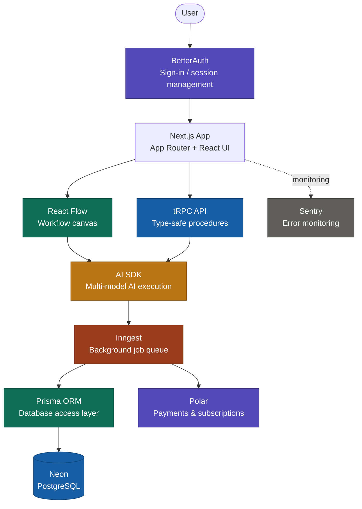

<div align="center">

# AIFY

### AI-powered workflows, beautifully crafted.

[](https://www.typescriptlang.org/)
[](https://nextjs.org/)
[](https://trpc.io/)
[](https://www.prisma.io/)
[](https://tailwindcss.com/)
[](https://www.postgresql.org/)

**[Live Demo](https://aify-seven.vercel.app)**

</div>

---

## Table of Contents

- [Overview](#overview)
- [Architecture](#architecture)
- [Features](#features)
- [Tech Stack](#tech-stack)
- [Getting Started](#getting-started)
- [Environment Variables](#environment-variables)
- [Project Structure](#project-structure)
- [Contributing](#contributing)
- [License](#license)

---

## Overview

**AIFY** is a full-stack AI platform that enables users to build, visualize, and run intelligent workflows. Powered by modern AI SDKs and a robust backend, AIFY brings together a seamless UI experience with background job processing, secure authentication, and integrated payments — all in one place.

---

## Architecture

The diagram below illustrates the end-to-end flow of the AIFY platform — from authentication through workflow execution, background processing, and data persistence.



---

## Features

- **AI Workflow Builder** — Visual drag-and-drop canvas powered by React Flow to design AI agent pipelines
- **Background Processing** — Long-running AI tasks handled gracefully via Inngest job queues
- **Authentication** — Secure, production-ready login and session management with BetterAuth
- **Payments & Subscriptions** — Monetize your workflows with Polar-powered billing
- **Multi-model AI Support** — Integrate multiple AI providers through the AI SDK
- **Beautiful UI** — Clean, accessible components with shadcn/ui and Tailwind CSS
- **End-to-End Type Safety** — Full-stack type safety from database to frontend using tRPC
- **Scalable Database** — PostgreSQL on Neon's serverless infrastructure with Prisma ORM
- **Error Monitoring** — Production-grade error tracking and observability with Sentry

---

## Tech Stack

| Layer | Technology |
|---|---|
| Framework | [Next.js](https://nextjs.org/) |
| Language | [TypeScript](https://www.typescriptlang.org/) |
| API Layer | [tRPC](https://trpc.io/) |
| Database ORM | [Prisma ORM](https://www.prisma.io/) |
| Database | [PostgreSQL](https://www.postgresql.org/) on [Neon](https://neon.tech/) |
| Background Jobs | [Inngest](https://www.inngest.com/) |
| UI Components | [shadcn/ui](https://ui.shadcn.com/) |
| Styling | [Tailwind CSS](https://tailwindcss.com/) |
| Icons | [Lucide React](https://lucide.dev/) |
| Workflow Canvas | [React Flow](https://reactflow.dev/) |
| AI SDKs | [Vercel AI SDK](https://sdk.vercel.ai/) |
| Payments | [Polar](https://polar.sh/) |
| Authentication | [BetterAuth](https://www.better-auth.com/) |
| Linting / Formatting | [Biome](https://biomejs.dev/) |
| Monitoring | [Sentry](https://sentry.io/) |

---

## Getting Started

### Prerequisites

Make sure you have the following installed:

- [Node.js](https://nodejs.org/) v18 or higher
- npm, [pnpm](https://pnpm.io/), or [yarn](https://yarnpkg.com/)
- A [Neon](https://neon.tech/) account for the database
- A [Polar](https://polar.sh/) account for payments
- A [BetterAuth](https://www.better-auth.com/) setup
- An [Inngest](https://www.inngest.com/) account for background jobs

### Installation

1. Clone the repository

```bash
git clone https://github.com/Saurabh89580/AIFY.git
cd AIFY
```

2. Install dependencies

```bash
npm install
```

3. Set up environment variables

```bash
cp .env.example .env
```

4. Push the database schema

```bash
npx prisma db push
```

5. Run the development server

```bash
npm run dev
```

The app will be running at [http://localhost:3000](http://localhost:3000).

6. Start the Inngest dev server (in a separate terminal)

```bash
npx inngest-cli@latest dev
```

---

## Environment Variables

Create a `.env` file in the root of the project with the following variables:

```env
# Database (Neon PostgreSQL)
DATABASE_URL="postgresql://..."

# BetterAuth
BETTER_AUTH_SECRET="your-secret"
BETTER_AUTH_URL="http://localhost:3000"

# Polar (Payments)
POLAR_ACCESS_TOKEN="your-polar-access-token"
POLAR_WEBHOOK_SECRET="your-polar-webhook-secret"

# Inngest
INNGEST_EVENT_KEY="your-inngest-event-key"
INNGEST_SIGNING_KEY="your-inngest-signing-key"

# AI Providers
OPENAI_API_KEY="sk-..."
ANTHROPIC_API_KEY="sk-ant-..."

# Sentry
SENTRY_DSN="your-sentry-dsn"
SENTRY_AUTH_TOKEN="your-sentry-auth-token"
```

> Never commit your `.env` file. It is already listed in `.gitignore`.

---

## Project Structure

```
AIFY/
├── prisma/
│   └── schema.prisma             # Database schema and models
│
├── public/                       # Static assets (images, icons, fonts)
│
├── src/
│   ├── app/                      # Next.js App Router
│   │   ├── (auth)/               # Auth routes (sign-in, sign-up)
│   │   ├── (dashboard)/          # Protected app routes
│   │   │   ├── workflows/        # Workflow builder pages
│   │   │   └── settings/         # User and billing settings
│   │   └── api/                  # API route handlers
│   │       ├── trpc/             # tRPC HTTP handler
│   │       ├── inngest/          # Inngest webhook endpoint
│   │       ├── auth/             # BetterAuth endpoints
│   │       └── webhooks/         # Polar payment webhooks
│   │
│   ├── components/               # Reusable React components
│   │   ├── ui/                   # shadcn/ui base components
│   │   ├── flow/                 # React Flow canvas and custom nodes
│   │   └── shared/               # Shared layout and common components
│   │
│   ├── server/                   # Server-side logic
│   │   ├── routers/              # tRPC routers (procedure definitions)
│   │   ├── inngest/              # Inngest background functions
│   │   └── db.ts                 # Prisma client instance
│   │
│   ├── trpc/                     # tRPC client and provider setup
│   │
│   ├── lib/                      # Utility functions and shared helpers
│   │
│   └── styles/
│       └── globals.css           # Global CSS and Tailwind base styles
│
├── .gitignore
├── biome.json                    # Biome linter and formatter config
├── components.json               # shadcn/ui component config
├── next.config.ts                # Next.js configuration
├── package.json
├── postcss.config.mjs            # PostCSS config for Tailwind
├── sentry.edge.config.ts         # Sentry config for Edge runtime
├── sentry.server.config.ts       # Sentry config for Node.js runtime
├── tsconfig.json                 # TypeScript configuration
└── README.md
```

---

## Contributing

Contributions are welcome. To get started:

1. Fork the repository
2. Create a new branch (`git checkout -b feature/your-feature`)
3. Commit your changes (`git commit -m 'feat: add your feature'`)
4. Push to your branch (`git push origin feature/your-feature`)
5. Open a Pull Request

Please follow the existing code style enforced by Biome and ensure all TypeScript types are correct before submitting.

---

## License

This project is licensed under the [MIT License](./LICENSE).

---

<div align="center">

Built with the modern web stack.

</div>
